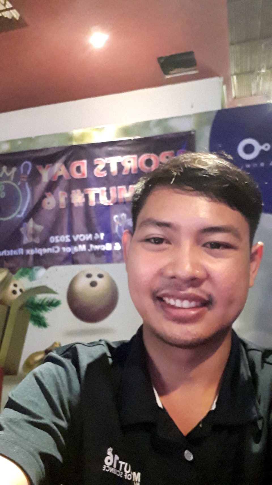

---

Theerapong Kanrawong
===============
## PERSONAL INFORMATION 
Mobile : 084-888-8888
Email : <info@test.com>
Date of Birth : 1X MXX 1XXX
Nationality : Thai
Age : 25
Interest and Activities : I started cybersecurity learning last year, *Like to kick football*

## AKA : **"@#ker"**

## Education
1. 2020 - Present [Master of Science Cybersecurity Engineering At Mahanakorn University of Technology](https://www.msit.mut.ac.th/)
2. 2015 - 2019 [Bachelor of Science Program in Information and Communication Technology At Sukhothai Thammathirat Open University](https://www.stou.ac.th/main/index.html)

Skills
===============

Hard Skill
---------------

|       Hard Skill          |                               Description                                     |
| ------------------------- | ----------------------------------------------------------------------------- |
|   Programming Languages   |   Python, Java, Pascal, C++                                                   |
|         Network           |   Installing, configuring and supporting network equipment                    |
|          OS               |   Installing, configuring and supporting Windows 10, windows 8, windows 7     |
|                           |                                                                               |

Soft Skill
---------------
> - Life-Long Learning
> - Collaboration
> - Adaptability
> - Working Under Pressure
> - Creativity

## WORK EXPEREINCE
    started his career as IT Support At Thaiparker, Samut Prakan THAILAND  (April 2015 – Present)
